# Design Modelling

## UML Models Overview

This document provides the complete set of visual UML models for the Unified Patient Access & Clinical Intelligence Platform. The diagrams are derived from two upstream sources:

- [spec.md](.propel/context/docs/spec.md) — Functional requirements and use cases (UC-001 to UC-010), which drive the sequence diagrams.
- [design.md](.propel/context/docs/design.md) — Architecture decisions, domain entities, technology stack, and AI requirements, which drive the architectural views.

**Document Navigation:**

| Section | Diagram Type | Purpose |
|---|---|---|
| System Context | PlantUML | Platform boundary and external actor interactions |
| Component Architecture | Mermaid | Internal module breakdown and communication |
| Deployment Architecture | PlantUML | GitHub Codespaces container topology |
| Data Flow | PlantUML | Clinical document ingestion pipeline |
| Logical Data Model (ERD) | Mermaid | All 11 domain entities with relationships |
| RAG Pipeline | PlantUML | AI offline ingestion and online retrieval flows |
| AI Sequence Diagrams | Mermaid | Sequence flows for AI-enabled use cases |
| Use Case Sequence Diagrams | Mermaid | One sequence diagram per UC-001 through UC-010 |

## Architectural Views

### System Context Diagram

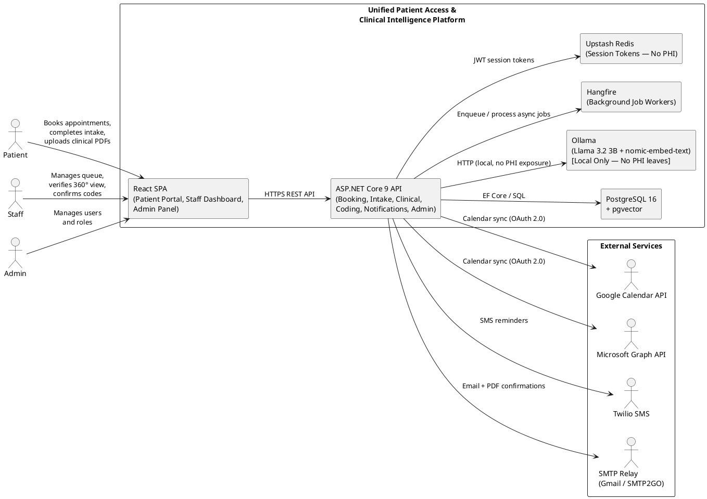
```plantuml
@startuml SystemContext
skinparam componentStyle rectangle
skinparam backgroundColor white
skinparam packageStyle rectangle
left to right direction

actor Patient
actor Staff
actor Admin

rectangle "External Services" as EXT {
  actor "Google Calendar API" as GCal
  actor "Microsoft Graph API" as MSGraph
  actor "Twilio SMS" as Twilio
  actor "SMTP Relay\n(Gmail / SMTP2GO)" as SMTP
}

rectangle "Unified Patient Access &\nClinical Intelligence Platform" as SYS {
  rectangle "React SPA\n(Patient Portal, Staff Dashboard,\nAdmin Panel)" as FE
  rectangle "ASP.NET Core 9 API\n(Booking, Intake, Clinical,\nCoding, Notifications, Admin)" as BE
  rectangle "PostgreSQL 16\n+ pgvector" as DB
  rectangle "Ollama\n(Llama 3.2 3B + nomic-embed-text)\n[Local Only — No PHI leaves]" as AI
  rectangle "Hangfire\n(Background Job Workers)" as HF
  rectangle "Upstash Redis\n(Session Tokens — No PHI)" as Cache
}

Patient --> FE : Books appointments,\ncompletes intake,\nuploads clinical PDFs
Staff --> FE : Manages queue,\nverifies 360° view,\nconfirms codes
Admin --> FE : Manages users\nand roles

FE --> BE : HTTPS REST API
BE --> DB : EF Core / SQL
BE --> AI : HTTP (local, no PHI exposure)
BE --> HF : Enqueue / process async jobs
BE --> Cache : JWT session tokens
BE --> GCal : Calendar sync (OAuth 2.0)
BE --> MSGraph : Calendar sync (OAuth 2.0)
BE --> Twilio : SMS reminders
BE --> SMTP : Email + PDF confirmations
@enduml
```

### Component Architecture Diagram

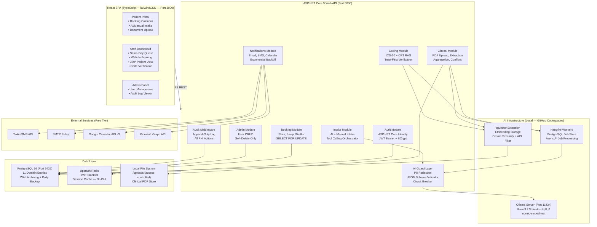
```mermaid
graph TD
    subgraph FrontEnd["React SPA (TypeScript + TailwindCSS — Port 3000)"]
        PP["Patient Portal\n• Booking Calendar\n• AI/Manual Intake\n• Document Upload"]
        SD["Staff Dashboard\n• Same-Day Queue\n• Walk-In Booking\n• 360° Patient View\n• Code Verification"]
        AP["Admin Panel\n• User Management\n• Audit Log Viewer"]
    end

    subgraph BackEnd["ASP.NET Core 9 Web API (Port 5000)"]
        AUTH["Auth Module\nASP.NET Core Identity\nJWT Bearer + BCrypt"]
        BOOK["Booking Module\nSlots, Swap, Waitlist\nSELECT FOR UPDATE"]
        INTAKE["Intake Module\nAI + Manual Intake\nTool Calling Orchestrator"]
        CLINICAL["Clinical Module\nPDF Upload, Extraction\nAggregation, Conflicts"]
        CODING["Coding Module\nICD-10 + CPT RAG\nTrust-First Verification"]
        NOTIF["Notifications Module\nEmail, SMS, Calendar\nExponential Backoff"]
        ADMIN["Admin Module\nUser CRUD\nSoft-Delete Only"]
        AUDIT["Audit Middleware\nAppend-Only Log\nAll PHI Actions"]
        AIGUARD["AI Guard Layer\nPII Redaction\nJSON Schema Validator\nCircuit Breaker"]
    end

    subgraph AILayer["AI Infrastructure (Local — GitHub Codespaces)"]
        OLLAMA["Ollama Server (Port 11434)\nllama3.2:3b-instruct-q8_0\nnomic-embed-text"]
        PGVEC["pgvector Extension\nEmbedding Storage\nCosine Similarity + ACL Filter"]
        HF["Hangfire Workers\nPostgreSQL Job Store\nAsync AI Job Processing"]
    end

    subgraph DataLayer["Data Layer"]
        PG["PostgreSQL 16 (Port 5432)\n11 Domain Entities\nWAL Archiving + Daily Backup"]
        REDIS["Upstash Redis\nJWT Blocklist\nSession Cache — No PHI"]
        FS["Local File System\n/uploads (access-controlled)\nClinical PDF Store"]
    end

    subgraph External["External Services (Free Tier)"]
        TWILIO["Twilio SMS API"]
        SMTPREL["SMTP Relay"]
        GCAL["Google Calendar API v3"]
        MSGRAPH["Microsoft Graph API"]
    end

    FrontEnd -->|HTTPS REST| BackEnd
    AUTH --> REDIS
    BOOK --> PG
    INTAKE --> AIGUARD
    CLINICAL --> FS
    CLINICAL --> HF
    HF --> AIGUARD
    AIGUARD --> OLLAMA
    CLINICAL --> PGVEC
    PGVEC --> PG
    CODING --> HF
    CODING --> PGVEC
    NOTIF --> TWILIO
    NOTIF --> SMTPREL
    NOTIF --> GCAL
    NOTIF --> MSGRAPH
    ADMIN --> PG
    AUDIT --> PG
    BackEnd --> PG
    BackEnd --> REDIS
```

### Deployment Architecture Diagram

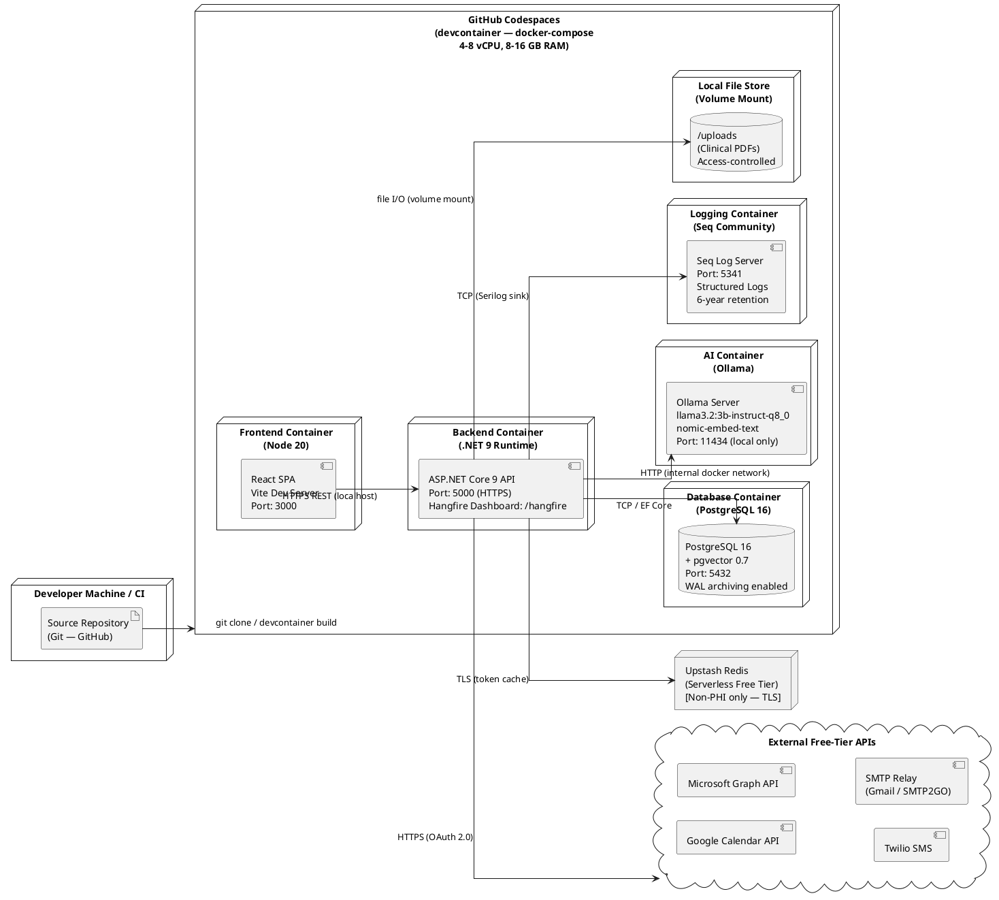
```plantuml
@startuml DeploymentArchitecture
skinparam nodeStyle rectangle
skinparam backgroundColor white
skinparam linetype ortho
left to right direction

node "Developer Machine / CI" as DEV {
  artifact "Source Repository\n(Git — GitHub)" as REPO
}

node "GitHub Codespaces\n(devcontainer — docker-compose\n4–8 vCPU, 8–16 GB RAM)" as CS {

  node "Frontend Container\n(Node 20)" as FE_NODE {
    component "React SPA\nVite Dev Server\nPort: 3000" as FE
  }

  node "Backend Container\n(.NET 9 Runtime)" as BE_NODE {
    component "ASP.NET Core 9 API\nPort: 5000 (HTTPS)\nHangfire Dashboard: /hangfire" as BE
  }

  node "Database Container\n(PostgreSQL 16)" as DB_NODE {
    database "PostgreSQL 16\n+ pgvector 0.7\nPort: 5432\nWAL archiving enabled" as PG
  }

  node "AI Container\n(Ollama)" as AI_NODE {
    component "Ollama Server\nllama3.2:3b-instruct-q8_0\nnomic-embed-text\nPort: 11434 (local only)" as OLLAMA
  }

  node "Logging Container\n(Seq Community)" as LOG_NODE {
    component "Seq Log Server\nPort: 5341\nStructured Logs\n6-year retention" as SEQ
  }

  node "Local File Store\n(Volume Mount)" as FSVOL {
    database "/uploads\n(Clinical PDFs)\nAccess-controlled" as FS
  }
}

node "Upstash Redis\n(Serverless Free Tier)\n[Non-PHI only — TLS]" as REDIS_EXT

cloud "External Free-Tier APIs" as EXTAPIS {
  component "Google Calendar API" as GCAL
  component "Microsoft Graph API" as MSG
  component "Twilio SMS" as TWILIO
  component "SMTP Relay\n(Gmail / SMTP2GO)" as SMTP
}

REPO --> CS : git clone / devcontainer build
FE --> BE : HTTPS REST (localhost)
BE --> PG : TCP / EF Core
BE --> OLLAMA : HTTP (internal docker network)
BE --> SEQ : TCP (Serilog sink)
BE --> FS : file I/O (volume mount)
BE --> REDIS_EXT : TLS (token cache)
BE --> EXTAPIS : HTTPS (OAuth 2.0)
@enduml
```

### Data Flow Diagram

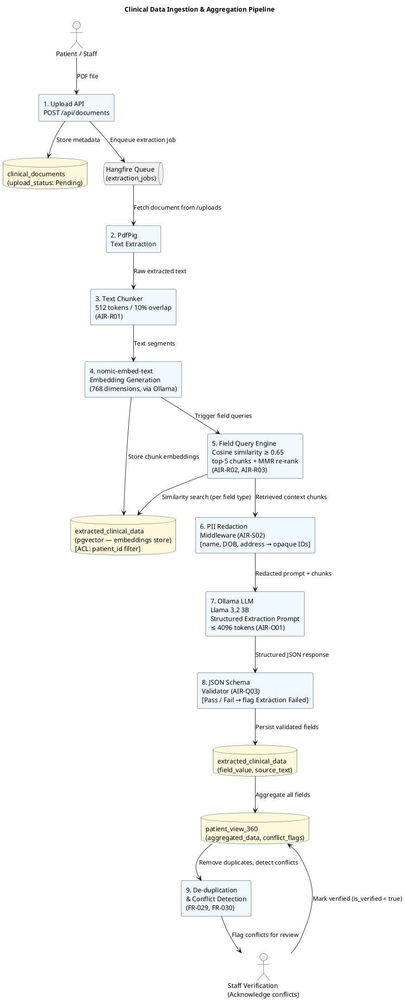
```plantuml
@startuml DataFlow
skinparam backgroundColor white
skinparam rectangleBackgroundColor #f0f8ff
skinparam databaseBackgroundColor #fff8dc
title Clinical Data Ingestion & Aggregation Pipeline

actor "Patient / Staff" as USER

rectangle "1. Upload API\nPOST /api/documents" as UPLOAD
database "clinical_documents\n(upload_status: Pending)" as DOCDB
queue "Hangfire Queue\n(extraction_jobs)" as QUEUE

rectangle "2. PdfPig\nText Extraction" as PDFPARSE

rectangle "3. Text Chunker\n512 tokens / 10% overlap\n(AIR-R01)" as CHUNKER

rectangle "4. nomic-embed-text\nEmbedding Generation\n(768 dimensions, via Ollama)" as EMBEDDER

database "extracted_clinical_data\n(pgvector — embeddings store)\n[ACL: patient_id filter]" as VECSTORE

rectangle "5. Field Query Engine\nCosine similarity ≥ 0.65\ntop-5 chunks + MMR re-rank\n(AIR-R02, AIR-R03)" as QUERYENG

rectangle "6. PII Redaction\nMiddleware (AIR-S02)\n[name, DOB, address → opaque IDs]" as PIIRED

rectangle "7. Ollama LLM\nLlama 3.2 3B\nStructured Extraction Prompt\n≤ 4096 tokens (AIR-O01)" as LLM

rectangle "8. JSON Schema\nValidator (AIR-Q03)\n[Pass / Fail → flag Extraction Failed]" as VALIDATOR

database "extracted_clinical_data\n(field_value, source_text)" as FIELDSTORE

database "patient_view_360\n(aggregated_data, conflict_flags)" as VIEW360

rectangle "9. De-duplication\n& Conflict Detection\n(FR-029, FR-030)" as DEDUP

actor "Staff Verification\n(Acknowledge conflicts)" as STAFFVER

USER --> UPLOAD : PDF file
UPLOAD --> DOCDB : Store metadata
UPLOAD --> QUEUE : Enqueue extraction job
QUEUE --> PDFPARSE : Fetch document from /uploads
PDFPARSE --> CHUNKER : Raw extracted text
CHUNKER --> EMBEDDER : Text segments
EMBEDDER --> VECSTORE : Store chunk embeddings
EMBEDDER --> QUERYENG : Trigger field queries
QUERYENG --> VECSTORE : Similarity search (per field type)
QUERYENG --> PIIRED : Retrieved context chunks
PIIRED --> LLM : Redacted prompt + chunks
LLM --> VALIDATOR : Structured JSON response
VALIDATOR --> FIELDSTORE : Persist validated fields
FIELDSTORE --> VIEW360 : Aggregate all fields
VIEW360 --> DEDUP : Remove duplicates, detect conflicts
DEDUP --> STAFFVER : Flag conflicts for review
STAFFVER --> VIEW360 : Mark verified (is_verified = true)
@enduml
```

### Logical Data Model (ERD)

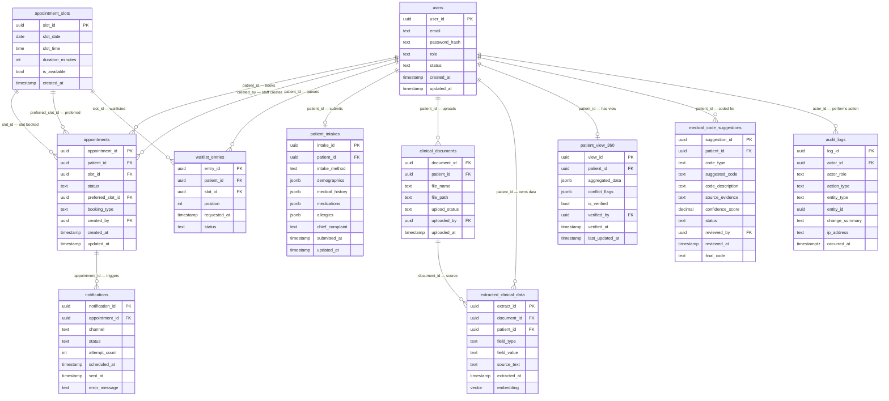
```mermaid
erDiagram
    users {
        uuid user_id PK
        text email
        text password_hash
        text role
        text status
        timestamp created_at
        timestamp updated_at
    }
    appointment_slots {
        uuid slot_id PK
        date slot_date
        time slot_time
        int duration_minutes
        bool is_available
        timestamp created_at
    }
    appointments {
        uuid appointment_id PK
        uuid patient_id FK
        uuid slot_id FK
        text status
        uuid preferred_slot_id FK
        text booking_type
        uuid created_by FK
        timestamp created_at
        timestamp updated_at
    }
    waitlist_entries {
        uuid entry_id PK
        uuid patient_id FK
        uuid slot_id FK
        int position
        timestamp requested_at
        text status
    }
    patient_intakes {
        uuid intake_id PK
        uuid patient_id FK
        text intake_method
        jsonb demographics
        jsonb medical_history
        jsonb medications
        jsonb allergies
        text chief_complaint
        timestamp submitted_at
        timestamp updated_at
    }
    clinical_documents {
        uuid document_id PK
        uuid patient_id FK
        text file_name
        text file_path
        text upload_status
        uuid uploaded_by FK
        timestamp uploaded_at
    }
    extracted_clinical_data {
        uuid extract_id PK
        uuid document_id FK
        uuid patient_id FK
        text field_type
        text field_value
        text source_text
        timestamp extracted_at
        vector embedding
    }
    patient_view_360 {
        uuid view_id PK
        uuid patient_id FK
        jsonb aggregated_data
        jsonb conflict_flags
        bool is_verified
        uuid verified_by FK
        timestamp verified_at
        timestamp last_updated_at
    }
    medical_code_suggestions {
        uuid suggestion_id PK
        uuid patient_id FK
        text code_type
        text suggested_code
        text code_description
        text source_evidence
        decimal confidence_score
        text status
        uuid reviewed_by FK
        timestamp reviewed_at
        text final_code
    }
    audit_logs {
        uuid log_id PK
        uuid actor_id FK
        text actor_role
        text action_type
        text entity_type
        uuid entity_id
        text change_summary
        text ip_address
        timestamptz occurred_at
    }
    notifications {
        uuid notification_id PK
        uuid appointment_id FK
        text channel
        text status
        int attempt_count
        timestamp scheduled_at
        timestamp sent_at
        text error_message
    }

    users ||--o{ appointments : "patient_id — books"
    users ||--o{ appointments : "created_by — staff creates"
    users ||--o{ waitlist_entries : "patient_id — queues"
    users ||--o| patient_intakes : "patient_id — submits"
    users ||--o{ clinical_documents : "patient_id — uploads"
    users ||--o{ extracted_clinical_data : "patient_id — owns data"
    users ||--o| patient_view_360 : "patient_id — has view"
    users ||--o{ medical_code_suggestions : "patient_id — coded for"
    users ||--o{ audit_logs : "actor_id — performs action"
    appointment_slots ||--o{ appointments : "slot_id — slot booked"
    appointment_slots ||--o{ appointments : "preferred_slot_id — preferred"
    appointment_slots ||--o{ waitlist_entries : "slot_id — waitlisted"
    appointments ||--o{ notifications : "appointment_id — triggers"
    clinical_documents ||--o{ extracted_clinical_data : "document_id — source"
```

### AI Architecture Diagrams

#### RAG Pipeline Diagram

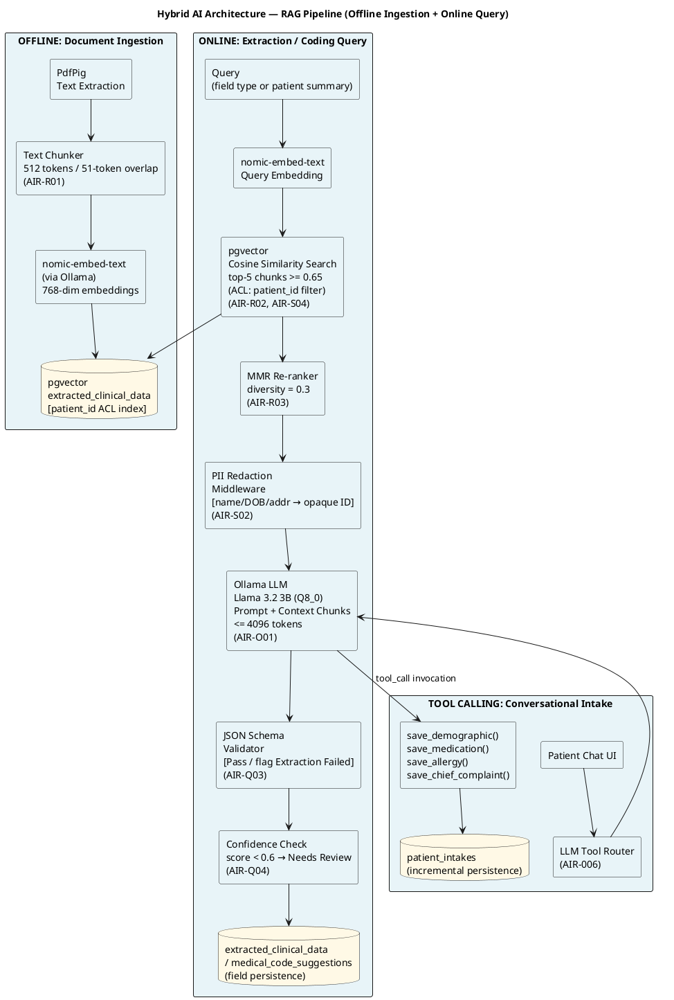
```plantuml
@startuml RAGPipeline
skinparam backgroundColor white
skinparam rectangleBackgroundColor #e8f4f8
skinparam databaseBackgroundColor #fff9e6
skinparam queueBackgroundColor #f0fff0
title Hybrid AI Architecture — RAG Pipeline (Offline Ingestion + Online Query)

rectangle "OFFLINE: Document Ingestion" {
    rectangle "PdfPig\nText Extraction" as PDFPIG
    rectangle "Text Chunker\n512 tokens / 51-token overlap\n(AIR-R01)" as CHUNK
    rectangle "nomic-embed-text\n(via Ollama)\n768-dim embeddings" as EMB_OFFLINE
    database "pgvector\nextracted_clinical_data\n[patient_id ACL index]" as PGVEC
}

rectangle "ONLINE: Extraction / Coding Query" {
    rectangle "Query\n(field type or patient summary)" as QUERY
    rectangle "nomic-embed-text\nQuery Embedding" as EMB_ONLINE
    rectangle "pgvector\nCosine Similarity Search\ntop-5 chunks >= 0.65\n(ACL: patient_id filter)\n(AIR-R02, AIR-S04)" as SEARCH
    rectangle "MMR Re-ranker\ndiversity = 0.3\n(AIR-R03)" as RERANK
    rectangle "PII Redaction\nMiddleware\n[name/DOB/addr → opaque ID]\n(AIR-S02)" as PIIRED
    rectangle "Ollama LLM\nLlama 3.2 3B (Q8_0)\nPrompt + Context Chunks\n<= 4096 tokens\n(AIR-O01)" as LLM
    rectangle "JSON Schema\nValidator\n[Pass / flag Extraction Failed]\n(AIR-Q03)" as VALID
    rectangle "Confidence Check\nscore < 0.6 → Needs Review\n(AIR-Q04)" as CONFCHECK
    database "extracted_clinical_data\n/ medical_code_suggestions\n(field persistence)" as PERSIST
}

rectangle "TOOL CALLING: Conversational Intake" {
    rectangle "Patient Chat UI" as CHAT
    rectangle "LLM Tool Router\n(AIR-006)" as TOOLROUTE
    rectangle "save_demographic()\nsave_medication()\nsave_allergy()\nsave_chief_complaint()" as TOOLS
    database "patient_intakes\n(incremental persistence)" as INTAKEDB
}

PDFPIG --> CHUNK
CHUNK --> EMB_OFFLINE
EMB_OFFLINE --> PGVEC

QUERY --> EMB_ONLINE
EMB_ONLINE --> SEARCH
SEARCH --> PGVEC
SEARCH --> RERANK
RERANK --> PIIRED
PIIRED --> LLM
LLM --> VALID
VALID --> CONFCHECK
CONFCHECK --> PERSIST

CHAT --> TOOLROUTE
TOOLROUTE --> LLM
LLM --> TOOLS : tool_call invocation
TOOLS --> INTAKEDB
@enduml
```

#### AI Sequence Diagram — UC-007 (Clinical Document Extraction)

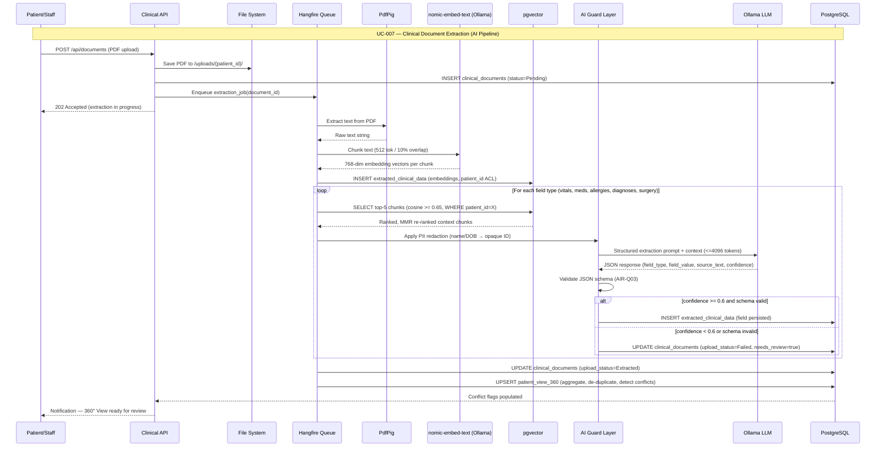
```mermaid
sequenceDiagram
    participant U as Patient/Staff
    participant API as Clinical API
    participant FS as File System
    participant HF as Hangfire Queue
    participant PDF as PdfPig
    participant EMB as nomic-embed-text (Ollama)
    participant VEC as pgvector
    participant GUARD as AI Guard Layer
    participant LLM as Ollama LLM
    participant DB as PostgreSQL

    Note over U,DB: UC-007 — Clinical Document Extraction (AI Pipeline)

    U->>API: POST /api/documents (PDF upload)
    API->>FS: Save PDF to /uploads/{patient_id}/
    API->>DB: INSERT clinical_documents (status=Pending)
    API->>HF: Enqueue extraction_job(document_id)
    API-->>U: 202 Accepted (extraction in progress)

    HF->>PDF: Extract text from PDF
    PDF-->>HF: Raw text string

    HF->>EMB: Chunk text (512 tok / 10% overlap)
    EMB-->>HF: 768-dim embedding vectors per chunk
    HF->>VEC: INSERT extracted_clinical_data (embeddings, patient_id ACL)

    loop For each field type (vitals, meds, allergies, diagnoses, surgery)
        HF->>VEC: SELECT top-5 chunks (cosine >= 0.65, WHERE patient_id=X)
        VEC-->>HF: Ranked, MMR re-ranked context chunks
        HF->>GUARD: Apply PII redaction (name/DOB → opaque ID)
        GUARD->>LLM: Structured extraction prompt + context (<=4096 tokens)
        LLM-->>GUARD: JSON response (field_type, field_value, source_text, confidence)
        GUARD->>GUARD: Validate JSON schema (AIR-Q03)
        alt confidence >= 0.6 and schema valid
            GUARD->>DB: INSERT extracted_clinical_data (field persisted)
        else confidence < 0.6 or schema invalid
            GUARD->>DB: UPDATE clinical_documents (upload_status=Failed, needs_review=true)
        end
    end

    HF->>DB: UPDATE clinical_documents (upload_status=Extracted)
    HF->>DB: UPSERT patient_view_360 (aggregate, de-duplicate, detect conflicts)
    DB-->>API: Conflict flags populated
    API-->>U: Notification — 360° View ready for review
```

#### AI Sequence Diagram — UC-008 (ICD-10 / CPT Code Mapping)

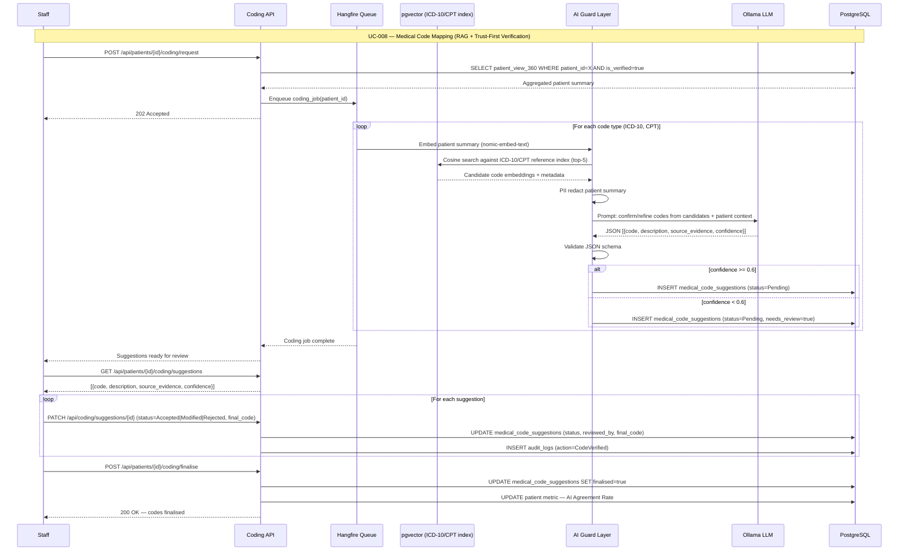
```mermaid
sequenceDiagram
    participant S as Staff
    participant API as Coding API
    participant HF as Hangfire Queue
    participant VEC as pgvector (ICD-10/CPT index)
    participant GUARD as AI Guard Layer
    participant LLM as Ollama LLM
    participant DB as PostgreSQL

    Note over S,DB: UC-008 — Medical Code Mapping (RAG + Trust-First Verification)

    S->>API: POST /api/patients/{id}/coding/request
    API->>DB: SELECT patient_view_360 WHERE patient_id=X AND is_verified=true
    DB-->>API: Aggregated patient summary
    API->>HF: Enqueue coding_job(patient_id)
    API-->>S: 202 Accepted

    loop For each code type (ICD-10, CPT)
        HF->>GUARD: Embed patient summary (nomic-embed-text)
        GUARD->>VEC: Cosine search against ICD-10/CPT reference index (top-5)
        VEC-->>GUARD: Candidate code embeddings + metadata
        GUARD->>GUARD: PII redact patient summary
        GUARD->>LLM: Prompt: confirm/refine codes from candidates + patient context
        LLM-->>GUARD: JSON [{code, description, source_evidence, confidence}]
        GUARD->>GUARD: Validate JSON schema
        alt confidence >= 0.6
            GUARD->>DB: INSERT medical_code_suggestions (status=Pending)
        else confidence < 0.6
            GUARD->>DB: INSERT medical_code_suggestions (status=Pending, needs_review=true)
        end
    end

    HF-->>API: Coding job complete
    API-->>S: Suggestions ready for review

    S->>API: GET /api/patients/{id}/coding/suggestions
    API-->>S: [{code, description, source_evidence, confidence}]

    loop For each suggestion
        S->>API: PATCH /api/coding/suggestions/{id} (status=Accepted|Modified|Rejected, final_code)
        API->>DB: UPDATE medical_code_suggestions (status, reviewed_by, final_code)
        API->>DB: INSERT audit_logs (action=CodeVerified)
    end

    S->>API: POST /api/patients/{id}/coding/finalise
    API->>DB: UPDATE medical_code_suggestions SET finalised=true
    API->>DB: UPDATE patient metric — AI Agreement Rate
    API-->>S: 200 OK — codes finalised
```

### Use Case Sequence Diagrams

> **Note**: Each sequence diagram below details the dynamic message flow for its corresponding use case defined in [spec.md](.propel/context/docs/spec.md). Use case diagrams (actor/system boundary views) remain in spec.md exclusively.

#### UC-001: Patient Registration and Login

**Source**: [spec.md — UC-001](.propel/context/docs/spec.md#UC-001)

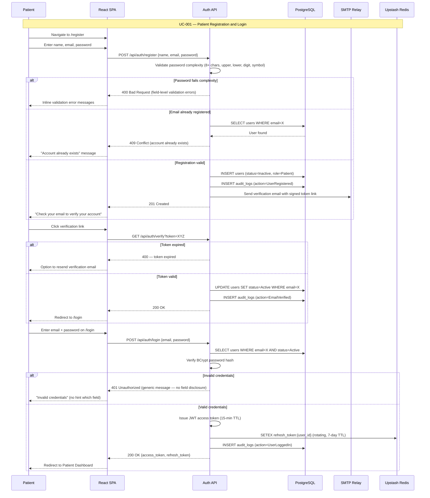
```mermaid
sequenceDiagram
    participant P as Patient
    participant FE as React SPA
    participant API as Auth API
    participant DB as PostgreSQL
    participant Email as SMTP Relay
    participant Redis as Upstash Redis

    Note over P,Redis: UC-001 — Patient Registration and Login

    P->>FE: Navigate to /register
    P->>FE: Enter name, email, password
    FE->>API: POST /api/auth/register {name, email, password}
    API->>API: Validate password complexity (8+ chars, upper, lower, digit, symbol)

    alt Password fails complexity
        API-->>FE: 400 Bad Request (field-level validation errors)
        FE-->>P: Inline validation error messages
    else Email already registered
        API->>DB: SELECT users WHERE email=X
        DB-->>API: User found
        API-->>FE: 409 Conflict (account already exists)
        FE-->>P: "Account already exists" message
    else Registration valid
        API->>DB: INSERT users (status=Inactive, role=Patient)
        API->>DB: INSERT audit_logs (action=UserRegistered)
        API->>Email: Send verification email with signed token link
        API-->>FE: 201 Created
        FE-->>P: "Check your email to verify your account"
    end

    P->>FE: Click verification link
    FE->>API: GET /api/auth/verify?token=XYZ
    alt Token expired
        API-->>FE: 400 — token expired
        FE-->>P: Option to resend verification email
    else Token valid
        API->>DB: UPDATE users SET status=Active WHERE email=X
        API->>DB: INSERT audit_logs (action=EmailVerified)
        API-->>FE: 200 OK
        FE-->>P: Redirect to /login
    end

    P->>FE: Enter email + password on /login
    FE->>API: POST /api/auth/login {email, password}
    API->>DB: SELECT users WHERE email=X AND status=Active
    API->>API: Verify BCrypt password hash

    alt Invalid credentials
        API-->>FE: 401 Unauthorized (generic message — no field disclosure)
        FE-->>P: "Invalid credentials" (no hint which field)
    else Valid credentials
        API->>API: Issue JWT access token (15-min TTL)
        API->>Redis: SETEX refresh_token:{user_id} (rotating, 7-day TTL)
        API->>DB: INSERT audit_logs (action=UserLoggedIn)
        API-->>FE: 200 OK {access_token, refresh_token}
        FE-->>P: Redirect to Patient Dashboard
    end
```

#### UC-002: Patient Intake (AI-Assisted or Manual)

**Source**: [spec.md — UC-002](.propel/context/docs/spec.md#UC-002)

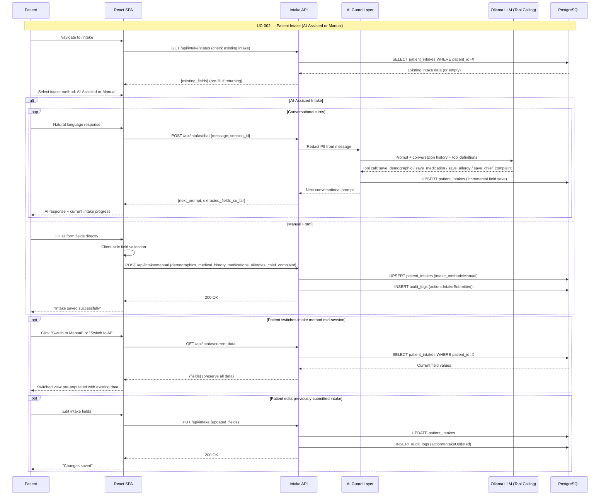
```mermaid
sequenceDiagram
    participant P as Patient
    participant FE as React SPA
    participant API as Intake API
    participant GUARD as AI Guard Layer
    participant LLM as Ollama LLM (Tool Calling)
    participant DB as PostgreSQL

    Note over P,DB: UC-002 — Patient Intake (AI-Assisted or Manual)

    P->>FE: Navigate to /intake
    FE->>API: GET /api/intake/status (check existing intake)
    API->>DB: SELECT patient_intakes WHERE patient_id=X
    DB-->>API: Existing intake data (or empty)
    API-->>FE: {existing_fields} (pre-fill if returning)

    P->>FE: Select intake method: AI-Assisted or Manual

    alt AI-Assisted Intake
        loop Conversational turns
            P->>FE: Natural language response
            FE->>API: POST /api/intake/chat {message, session_id}
            API->>GUARD: Redact PII from message
            GUARD->>LLM: Prompt + conversation history + tool definitions
            LLM-->>GUARD: Tool call: save_demographic / save_medication / save_allergy / save_chief_complaint
            GUARD->>DB: UPSERT patient_intakes (incremental field save)
            GUARD-->>API: Next conversational prompt
            API-->>FE: {next_prompt, extracted_fields_so_far}
            FE-->>P: AI response + current intake progress
        end
    else Manual Form
        P->>FE: Fill all form fields directly
        FE->>FE: Client-side field validation
        FE->>API: POST /api/intake/manual {demographics, medical_history, medications, allergies, chief_complaint}
        API->>DB: UPSERT patient_intakes (intake_method=Manual)
        API->>DB: INSERT audit_logs (action=IntakeSubmitted)
        API-->>FE: 200 OK
        FE-->>P: "Intake saved successfully"
    end

    opt Patient switches intake method mid-session
        P->>FE: Click "Switch to Manual" or "Switch to AI"
        FE->>API: GET /api/intake/current-data
        API->>DB: SELECT patient_intakes WHERE patient_id=X
        DB-->>API: Current field values
        API-->>FE: {fields} (preserve all data)
        FE-->>P: Switched view pre-populated with existing data
    end

    opt Patient edits previously submitted intake
        P->>FE: Edit intake fields
        FE->>API: PUT /api/intake {updated_fields}
        API->>DB: UPDATE patient_intakes
        API->>DB: INSERT audit_logs (action=IntakeUpdated)
        API-->>FE: 200 OK
        FE-->>P: "Changes saved"
    end
```

#### UC-003: Appointment Booking with Preferred Slot Swap

**Source**: [spec.md — UC-003](.propel/context/docs/spec.md#UC-003)

```mermaid
sequenceDiagram
    participant P as Patient
    participant FE as React SPA
    participant API as Booking API
    participant DB as PostgreSQL
    participant HF as Hangfire
    participant PDF as QuestPDF
    participant Email as SMTP Relay
    participant GCal as Google Calendar API
    participant MSCal as Microsoft Graph API

    Note over P,MSCal: UC-003 — Appointment Booking with Preferred Slot Swap

    P->>FE: Navigate to /book
    FE->>API: GET /api/slots?date_range=X
    API->>DB: SELECT appointment_slots WHERE is_available=true
    DB-->>API: Available + unavailable slots
    API-->>FE: Slot grid with availability
    FE-->>P: Booking calendar view

    P->>FE: Select available slot + optional preferred slot
    P->>FE: Enter insurance name + insurance ID
    FE->>API: POST /api/appointments/book {slot_id, preferred_slot_id?, insurance_name, insurance_id}

    API->>DB: SELECT insurance_records WHERE name=X AND id=Y
    DB-->>API: Matched / Unmatched / Not Found
    Note over API: Insurance result stored — does NOT block booking

    API->>DB: BEGIN TRANSACTION
    API->>DB: SELECT appointment_slots WHERE slot_id=X FOR UPDATE
    alt Slot no longer available
        API->>DB: ROLLBACK
        API-->>FE: 409 Conflict — slot taken
        FE-->>P: "Slot no longer available, please select another"
    else Slot available
        API->>DB: INSERT appointments (status=Confirmed, preferred_slot_id=Y?)
        API->>DB: UPDATE appointment_slots SET is_available=false
        alt preferred_slot_id provided
            API->>DB: INSERT waitlist_entries (slot_id=preferred_slot_id, patient_id=X)
        end
        API->>DB: INSERT audit_logs (action=AppointmentBooked)
        API->>DB: COMMIT
        API->>HF: Enqueue send_confirmation_job(appointment_id)
        API->>HF: Enqueue calendar_sync_job(appointment_id)
        API-->>FE: 201 Created {appointment_id}
        FE-->>P: "Appointment confirmed"
    end

    HF->>PDF: Generate PDF confirmation document
    PDF-->>HF: PDF bytes
    HF->>Email: Send email with PDF attachment to patient
    HF->>GCal: Create calendar event (OAuth 2.0)
    HF->>MSCal: Create calendar event (OAuth 2.0)
    Note over HF: Calendar failures logged; booking NOT rolled back (NFR-014)

    opt Preferred slot becomes available (swap trigger)
        Note over HF: SlotReleasedEvent detected
        HF->>DB: SELECT waitlist_entries WHERE slot_id=Y AND status=Waiting ORDER BY requested_at LIMIT 1 FOR UPDATE
        HF->>DB: UPDATE appointments SET slot_id=Y, preferred_slot_id=null
        HF->>DB: UPDATE appointment_slots (original slot) SET is_available=true
        HF->>DB: UPDATE appointment_slots (preferred slot) SET is_available=false
        HF->>DB: UPDATE waitlist_entries SET status=Fulfilled
        HF->>DB: INSERT audit_logs (action=PreferredSlotSwapped)
        HF->>Email: Notify patient of slot swap
    end
```

#### UC-004: Staff Walk-In Booking

**Source**: [spec.md — UC-004](.propel/context/docs/spec.md#UC-004)

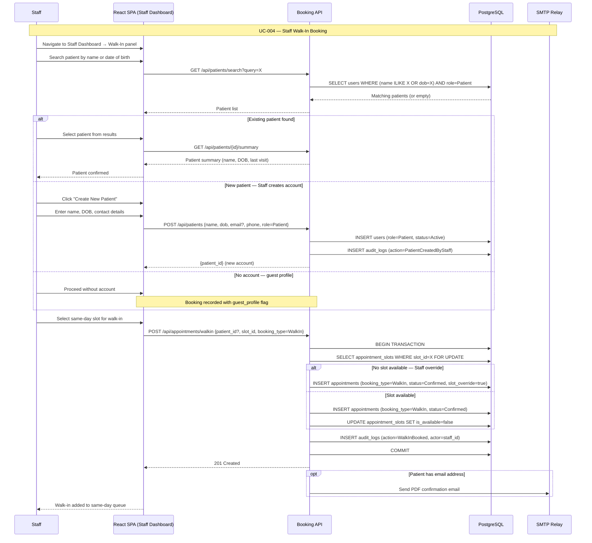
```mermaid
sequenceDiagram
    participant S as Staff
    participant FE as React SPA (Staff Dashboard)
    participant API as Booking API
    participant DB as PostgreSQL
    participant Email as SMTP Relay

    Note over S,Email: UC-004 — Staff Walk-In Booking

    S->>FE: Navigate to Staff Dashboard → Walk-In panel
    S->>FE: Search patient by name or date of birth
    FE->>API: GET /api/patients/search?query=X
    API->>DB: SELECT users WHERE (name ILIKE X OR dob=X) AND role=Patient
    DB-->>API: Matching patients (or empty)
    API-->>FE: Patient list

    alt Existing patient found
        S->>FE: Select patient from results
        FE->>API: GET /api/patients/{id}/summary
        API-->>FE: Patient summary (name, DOB, last visit)
        FE-->>S: Patient confirmed
    else New patient — Staff creates account
        S->>FE: Click "Create New Patient"
        S->>FE: Enter name, DOB, contact details
        FE->>API: POST /api/patients {name, dob, email?, phone, role=Patient}
        API->>DB: INSERT users (role=Patient, status=Active)
        API->>DB: INSERT audit_logs (action=PatientCreatedByStaff)
        API-->>FE: {patient_id} (new account)
    else No account — guest profile
        S->>FE: Proceed without account
        Note over FE,API: Booking recorded with guest_profile flag
    end

    S->>FE: Select same-day slot for walk-in
    FE->>API: POST /api/appointments/walkin {patient_id?, slot_id, booking_type=WalkIn}
    API->>DB: BEGIN TRANSACTION
    API->>DB: SELECT appointment_slots WHERE slot_id=X FOR UPDATE
    alt No slot available — Staff override
        API->>DB: INSERT appointments (booking_type=WalkIn, status=Confirmed, slot_override=true)
    else Slot available
        API->>DB: INSERT appointments (booking_type=WalkIn, status=Confirmed)
        API->>DB: UPDATE appointment_slots SET is_available=false
    end
    API->>DB: INSERT audit_logs (action=WalkInBooked, actor=staff_id)
    API->>DB: COMMIT
    API-->>FE: 201 Created

    opt Patient has email address
        API->>Email: Send PDF confirmation email
    end

    FE-->>S: Walk-in added to same-day queue
```

#### UC-005: Manage Same-Day Queue and Mark Patient Arrival

**Source**: [spec.md — UC-005](.propel/context/docs/spec.md#UC-005)

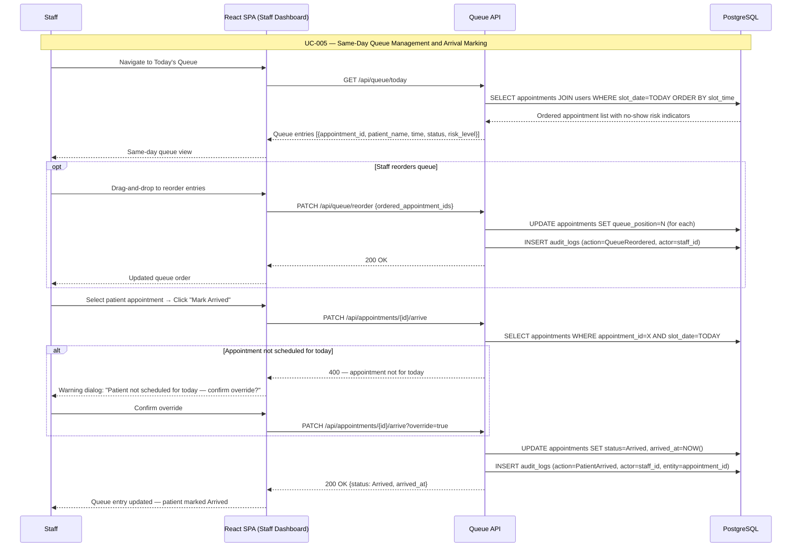
```mermaid
sequenceDiagram
    participant S as Staff
    participant FE as React SPA (Staff Dashboard)
    participant API as Queue API
    participant DB as PostgreSQL

    Note over S,DB: UC-005 — Same-Day Queue Management and Arrival Marking

    S->>FE: Navigate to Today's Queue
    FE->>API: GET /api/queue/today
    API->>DB: SELECT appointments JOIN users WHERE slot_date=TODAY ORDER BY slot_time
    DB-->>API: Ordered appointment list with no-show risk indicators
    API-->>FE: Queue entries [{appointment_id, patient_name, time, status, risk_level}]
    FE-->>S: Same-day queue view

    opt Staff reorders queue
        S->>FE: Drag-and-drop to reorder entries
        FE->>API: PATCH /api/queue/reorder {ordered_appointment_ids}
        API->>DB: UPDATE appointments SET queue_position=N (for each)
        API->>DB: INSERT audit_logs (action=QueueReordered, actor=staff_id)
        API-->>FE: 200 OK
        FE-->>S: Updated queue order
    end

    S->>FE: Select patient appointment → Click "Mark Arrived"
    FE->>API: PATCH /api/appointments/{id}/arrive
    API->>DB: SELECT appointments WHERE appointment_id=X AND slot_date=TODAY

    alt Appointment not scheduled for today
        API-->>FE: 400 — appointment not for today
        FE-->>S: Warning dialog: "Patient not scheduled for today — confirm override?"
        S->>FE: Confirm override
        FE->>API: PATCH /api/appointments/{id}/arrive?override=true
    end

    API->>DB: UPDATE appointments SET status=Arrived, arrived_at=NOW()
    API->>DB: INSERT audit_logs (action=PatientArrived, actor=staff_id, entity=appointment_id)
    API-->>FE: 200 OK {status: Arrived, arrived_at}
    FE-->>S: Queue entry updated — patient marked Arrived
```

#### UC-006: Appointment Reminders and Calendar Sync

**Source**: [spec.md — UC-006](.propel/context/docs/spec.md#UC-006)

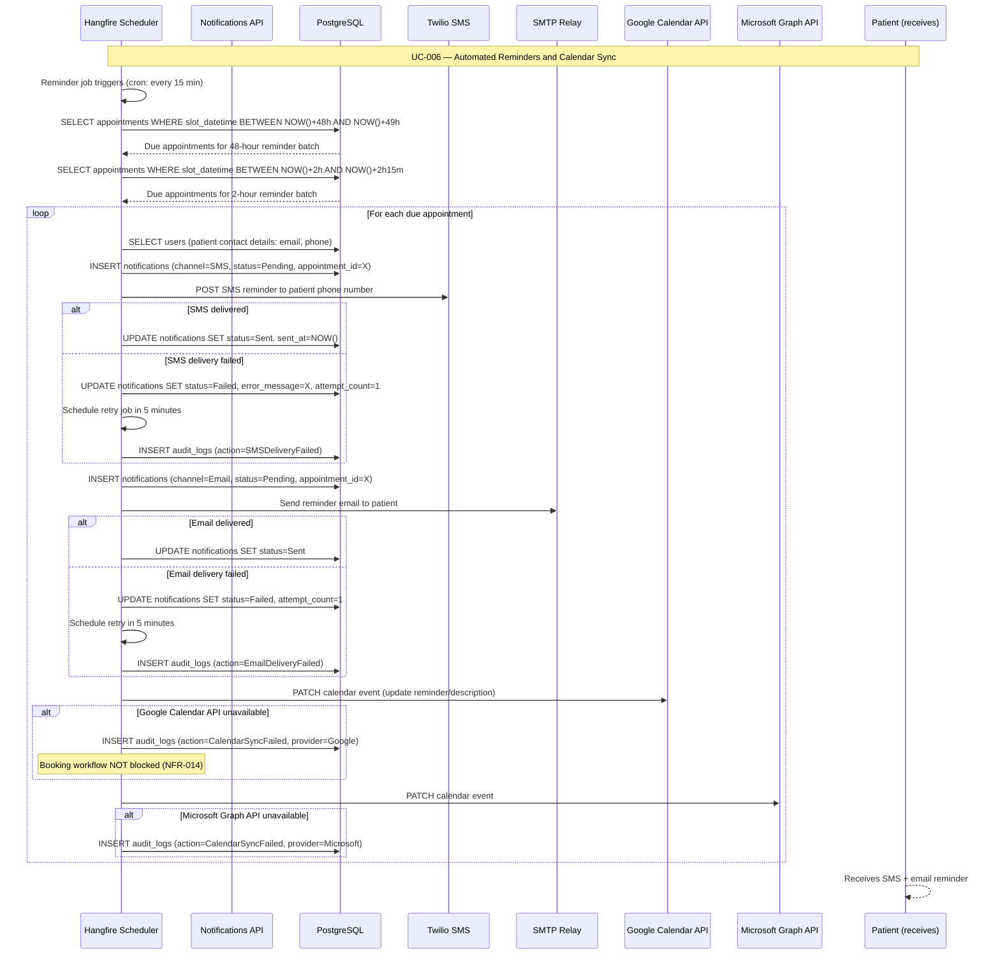
```mermaid
sequenceDiagram
    participant HF as Hangfire Scheduler
    participant API as Notifications API
    participant DB as PostgreSQL
    participant Twilio as Twilio SMS
    participant Email as SMTP Relay
    participant GCal as Google Calendar API
    participant MSCal as Microsoft Graph API
    participant P as Patient (receives)

    Note over HF,P: UC-006 — Automated Reminders and Calendar Sync

    HF->>HF: Reminder job triggers (cron: every 15 min)
    HF->>DB: SELECT appointments WHERE slot_datetime BETWEEN NOW()+48h AND NOW()+49h
    DB-->>HF: Due appointments for 48-hour reminder batch
    HF->>DB: SELECT appointments WHERE slot_datetime BETWEEN NOW()+2h AND NOW()+2h15m
    DB-->>HF: Due appointments for 2-hour reminder batch

    loop For each due appointment
        HF->>DB: SELECT users (patient contact details: email, phone)
        HF->>DB: INSERT notifications (channel=SMS, status=Pending, appointment_id=X)
        HF->>Twilio: POST SMS reminder to patient phone number
        alt SMS delivered
            HF->>DB: UPDATE notifications SET status=Sent, sent_at=NOW()
        else SMS delivery failed
            HF->>DB: UPDATE notifications SET status=Failed, error_message=X, attempt_count=1
            HF->>HF: Schedule retry job in 5 minutes
            HF->>DB: INSERT audit_logs (action=SMSDeliveryFailed)
        end

        HF->>DB: INSERT notifications (channel=Email, status=Pending, appointment_id=X)
        HF->>Email: Send reminder email to patient
        alt Email delivered
            HF->>DB: UPDATE notifications SET status=Sent
        else Email delivery failed
            HF->>DB: UPDATE notifications SET status=Failed, attempt_count=1
            HF->>HF: Schedule retry in 5 minutes
            HF->>DB: INSERT audit_logs (action=EmailDeliveryFailed)
        end

        HF->>GCal: PATCH calendar event (update reminder/description)
        alt Google Calendar API unavailable
            HF->>DB: INSERT audit_logs (action=CalendarSyncFailed, provider=Google)
            Note over HF: Booking workflow NOT blocked (NFR-014)
        end

        HF->>MSCal: PATCH calendar event
        alt Microsoft Graph API unavailable
            HF->>DB: INSERT audit_logs (action=CalendarSyncFailed, provider=Microsoft)
        end
    end

    P-->>P: Receives SMS + email reminder
```

#### UC-007: Clinical Document Upload and 360-Degree Patient View

**Source**: [spec.md — UC-007](.propel/context/docs/spec.md#UC-007)

> See also: [AI Sequence Diagram — UC-007](#ai-sequence-diagram--uc-007-clinical-document-extraction) above for the detailed AI pipeline flow.

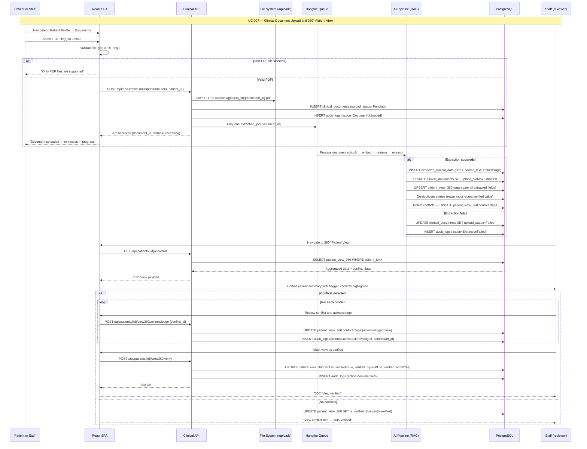
```mermaid
sequenceDiagram
    participant U as Patient or Staff
    participant FE as React SPA
    participant API as Clinical API
    participant FS as File System (/uploads)
    participant HF as Hangfire Queue
    participant AI as AI Pipeline (RAG)
    participant DB as PostgreSQL
    participant S as Staff (reviewer)

    Note over U,S: UC-007 — Clinical Document Upload and 360° Patient View

    U->>FE: Navigate to Patient Profile → Documents
    U->>FE: Select PDF file(s) to upload
    FE->>FE: Validate file type (PDF only)

    alt Non-PDF file selected
        FE-->>U: "Only PDF files are supported"
    else Valid PDF
        FE->>API: POST /api/documents (multipart/form-data, patient_id)
        API->>FS: Save PDF to /uploads/{patient_id}/{document_id}.pdf
        API->>DB: INSERT clinical_documents (upload_status=Pending)
        API->>DB: INSERT audit_logs (action=DocumentUploaded)
        API->>HF: Enqueue extraction_job(document_id)
        API-->>FE: 202 Accepted {document_id, status=Processing}
        FE-->>U: "Document uploaded — extraction in progress"
    end

    HF->>AI: Process document (chunk → embed → retrieve → extract)
    alt Extraction succeeds
        AI->>DB: INSERT extracted_clinical_data (fields, source_text, embeddings)
        AI->>DB: UPDATE clinical_documents SET upload_status=Extracted
        AI->>DB: UPSERT patient_view_360 (aggregate all extracted fields)
        AI->>DB: De-duplicate entries (retain most recent verified value)
        AI->>DB: Detect conflicts → UPDATE patient_view_360.conflict_flags
    else Extraction fails
        AI->>DB: UPDATE clinical_documents SET upload_status=Failed
        AI->>DB: INSERT audit_logs (action=ExtractionFailed)
    end

    S->>FE: Navigate to 360° Patient View
    FE->>API: GET /api/patients/{id}/view360
    API->>DB: SELECT patient_view_360 WHERE patient_id=X
    DB-->>API: Aggregated data + conflict_flags
    API-->>FE: 360° View payload
    FE-->>S: Unified patient summary with flagged conflicts highlighted

    alt Conflicts detected
        loop For each conflict
            S->>FE: Review conflict and acknowledge
            FE->>API: POST /api/patients/{id}/view360/acknowledge {conflict_id}
            API->>DB: UPDATE patient_view_360.conflict_flags (acknowledged=true)
            API->>DB: INSERT audit_logs (action=ConflictAcknowledged, actor=staff_id)
        end
        S->>FE: Mark view as verified
        FE->>API: POST /api/patients/{id}/view360/verify
        API->>DB: UPDATE patient_view_360 SET is_verified=true, verified_by=staff_id, verified_at=NOW()
        API->>DB: INSERT audit_logs (action=ViewVerified)
        API-->>FE: 200 OK
        FE-->>S: "360° View verified"
    else No conflicts
        API->>DB: UPDATE patient_view_360 SET is_verified=true (auto-verified)
        FE-->>S: "View conflict-free — auto-verified"
    end
```

#### UC-008: Medical Code Mapping with Trust-First Verification

**Source**: [spec.md — UC-008](.propel/context/docs/spec.md#UC-008)

> See also: [AI Sequence Diagram — UC-008](#ai-sequence-diagram--uc-008-icd-10--cpt-code-mapping) above for the detailed AI coding flow.

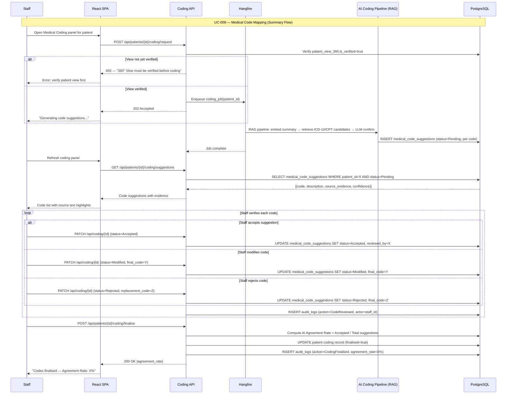
```mermaid
sequenceDiagram
    participant S as Staff
    participant FE as React SPA
    participant API as Coding API
    participant HF as Hangfire
    participant AI as AI Coding Pipeline (RAG)
    participant DB as PostgreSQL

    Note over S,DB: UC-008 — Medical Code Mapping (Summary Flow)

    S->>FE: Open Medical Coding panel for patient
    FE->>API: POST /api/patients/{id}/coding/request
    API->>DB: Verify patient_view_360.is_verified=true
    alt View not yet verified
        API-->>FE: 400 — "360° View must be verified before coding"
        FE-->>S: Error: verify patient view first
    else View verified
        API->>HF: Enqueue coding_job(patient_id)
        API-->>FE: 202 Accepted
        FE-->>S: "Generating code suggestions..."
    end

    HF->>AI: RAG pipeline: embed summary → retrieve ICD-10/CPT candidates → LLM confirm
    AI->>DB: INSERT medical_code_suggestions (status=Pending, per code)
    HF-->>API: Job complete

    S->>FE: Refresh coding panel
    FE->>API: GET /api/patients/{id}/coding/suggestions
    API->>DB: SELECT medical_code_suggestions WHERE patient_id=X AND status=Pending
    DB-->>API: [{code, description, source_evidence, confidence}]
    API-->>FE: Code suggestions with evidence
    FE-->>S: Code list with source text highlights

    loop Staff verifies each code
        alt Staff accepts suggestion
            S->>API: PATCH /api/coding/{id} {status=Accepted}
            API->>DB: UPDATE medical_code_suggestions SET status=Accepted, reviewed_by=X
        else Staff modifies code
            S->>API: PATCH /api/coding/{id} {status=Modified, final_code=Y}
            API->>DB: UPDATE medical_code_suggestions SET status=Modified, final_code=Y
        else Staff rejects code
            S->>API: PATCH /api/coding/{id} {status=Rejected, replacement_code=Z}
            API->>DB: UPDATE medical_code_suggestions SET status=Rejected, final_code=Z
        end
        API->>DB: INSERT audit_logs (action=CodeReviewed, actor=staff_id)
    end

    S->>API: POST /api/patients/{id}/coding/finalise
    API->>DB: Compute AI Agreement Rate = Accepted / Total suggestions
    API->>DB: UPDATE patient coding record (finalised=true)
    API->>DB: INSERT audit_logs (action=CodingFinalised, agreement_rate=X%)
    API-->>FE: 200 OK {agreement_rate}
    FE-->>S: "Codes finalised — Agreement Rate: X%"
```

#### UC-009: No-Show Risk Assessment

**Source**: [spec.md — UC-009](.propel/context/docs/spec.md#UC-009)

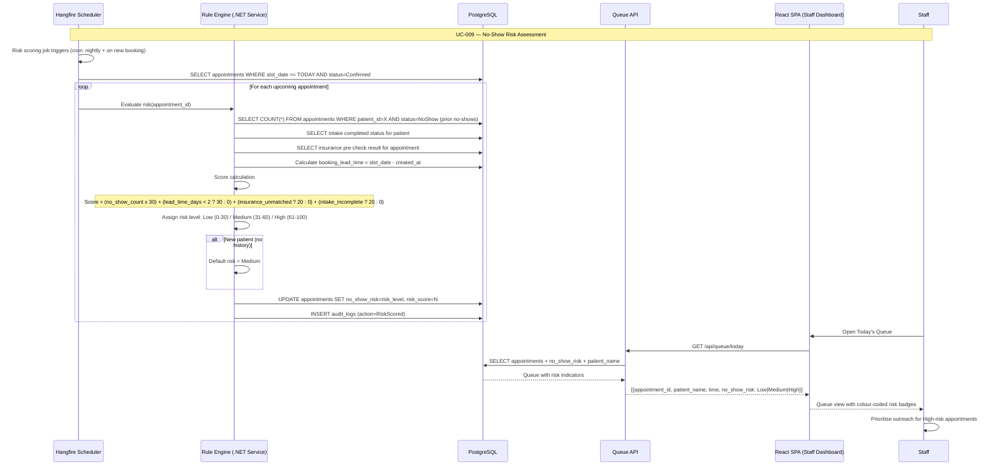
```mermaid
sequenceDiagram
    participant HF as Hangfire Scheduler
    participant RE as Rule Engine (.NET Service)
    participant DB as PostgreSQL
    participant API as Queue API
    participant FE as React SPA (Staff Dashboard)
    participant S as Staff

    Note over HF,S: UC-009 — No-Show Risk Assessment

    HF->>HF: Risk scoring job triggers (cron: nightly + on new booking)
    HF->>DB: SELECT appointments WHERE slot_date >= TODAY AND status=Confirmed

    loop For each upcoming appointment
        HF->>RE: Evaluate risk(appointment_id)
        RE->>DB: SELECT COUNT(*) FROM appointments WHERE patient_id=X AND status=NoShow (prior no-shows)
        RE->>DB: SELECT intake completed status for patient
        RE->>DB: SELECT insurance pre-check result for appointment
        RE->>DB: Calculate booking_lead_time = slot_date - created_at

        RE->>RE: Score calculation
        Note over RE: Score = (no_show_count x 30) + (lead_time_days < 2 ? 30 : 0) + (insurance_unmatched ? 20 : 0) + (intake_incomplete ? 20 : 0)
        RE->>RE: Assign risk level: Low (0-30) / Medium (31-60) / High (61-100)

        alt New patient (no history)
            RE->>RE: Default risk = Medium
        end

        RE->>DB: UPDATE appointments SET no_show_risk=risk_level, risk_score=N
        RE->>DB: INSERT audit_logs (action=RiskScored)
    end

    S->>FE: Open Today's Queue
    FE->>API: GET /api/queue/today
    API->>DB: SELECT appointments + no_show_risk + patient_name
    DB-->>API: Queue with risk indicators
    API-->>FE: [{appointment_id, patient_name, time, no_show_risk: Low|Medium|High}]
    FE-->>S: Queue view with colour-coded risk badges

    S->>S: Prioritise outreach for High-risk appointments
```

#### UC-010: Admin User Management

**Source**: [spec.md — UC-010](.propel/context/docs/spec.md#UC-010)

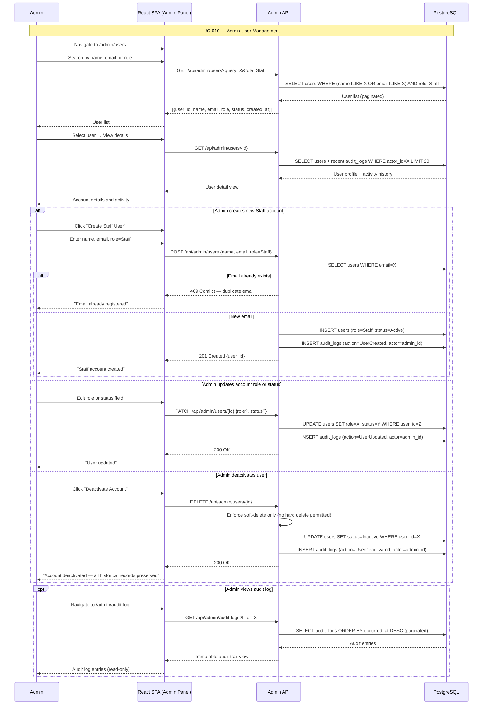
```mermaid
sequenceDiagram
    participant A as Admin
    participant FE as React SPA (Admin Panel)
    participant API as Admin API
    participant DB as PostgreSQL

    Note over A,DB: UC-010 — Admin User Management

    A->>FE: Navigate to /admin/users
    A->>FE: Search by name, email, or role
    FE->>API: GET /api/admin/users?query=X&role=Staff
    API->>DB: SELECT users WHERE (name ILIKE X OR email ILIKE X) AND role=Staff
    DB-->>API: User list (paginated)
    API-->>FE: [{user_id, name, email, role, status, created_at}]
    FE-->>A: User list

    A->>FE: Select user → View details
    FE->>API: GET /api/admin/users/{id}
    API->>DB: SELECT users + recent audit_logs WHERE actor_id=X LIMIT 20
    DB-->>API: User profile + activity history
    API-->>FE: User detail view
    FE-->>A: Account details and activity

    alt Admin creates new Staff account
        A->>FE: Click "Create Staff User"
        A->>FE: Enter name, email, role=Staff
        FE->>API: POST /api/admin/users {name, email, role=Staff}
        API->>DB: SELECT users WHERE email=X
        alt Email already exists
            API-->>FE: 409 Conflict — duplicate email
            FE-->>A: "Email already registered"
        else New email
            API->>DB: INSERT users (role=Staff, status=Active)
            API->>DB: INSERT audit_logs (action=UserCreated, actor=admin_id)
            API-->>FE: 201 Created {user_id}
            FE-->>A: "Staff account created"
        end
    else Admin updates account role or status
        A->>FE: Edit role or status field
        FE->>API: PATCH /api/admin/users/{id} {role?, status?}
        API->>DB: UPDATE users SET role=X, status=Y WHERE user_id=Z
        API->>DB: INSERT audit_logs (action=UserUpdated, actor=admin_id)
        API-->>FE: 200 OK
        FE-->>A: "User updated"
    else Admin deactivates user
        A->>FE: Click "Deactivate Account"
        FE->>API: DELETE /api/admin/users/{id}
        API->>API: Enforce soft-delete only (no hard delete permitted)
        API->>DB: UPDATE users SET status=Inactive WHERE user_id=X
        API->>DB: INSERT audit_logs (action=UserDeactivated, actor=admin_id)
        API-->>FE: 200 OK
        FE-->>A: "Account deactivated — all historical records preserved"
    end

    opt Admin views audit log
        A->>FE: Navigate to /admin/audit-log
        FE->>API: GET /api/admin/audit-logs?filter=X
        API->>DB: SELECT audit_logs ORDER BY occurred_at DESC (paginated)
        DB-->>API: Audit entries
        API-->>FE: Immutable audit trail view
        FE-->>A: Audit log entries (read-only)
    end
```
