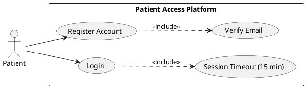
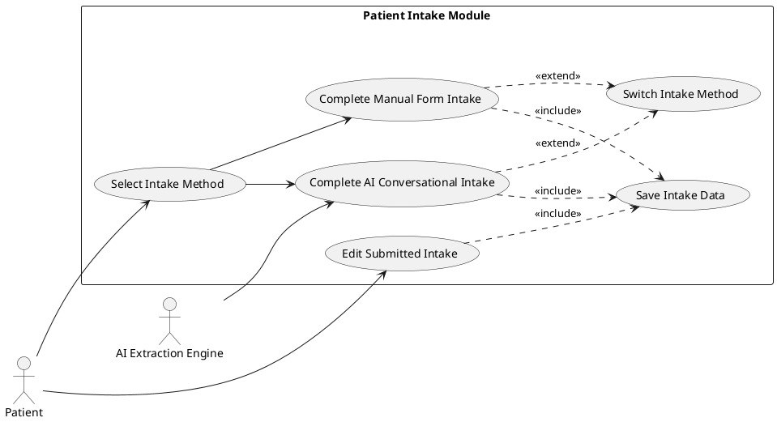
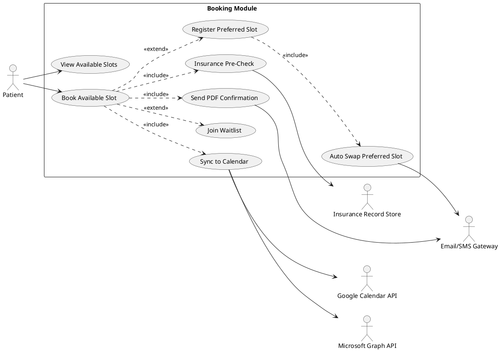
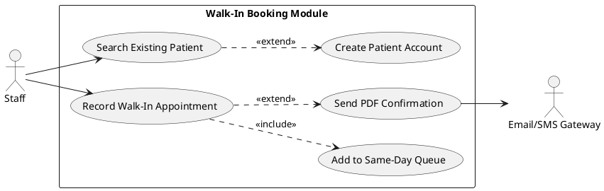
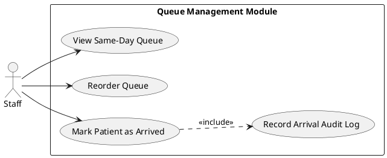
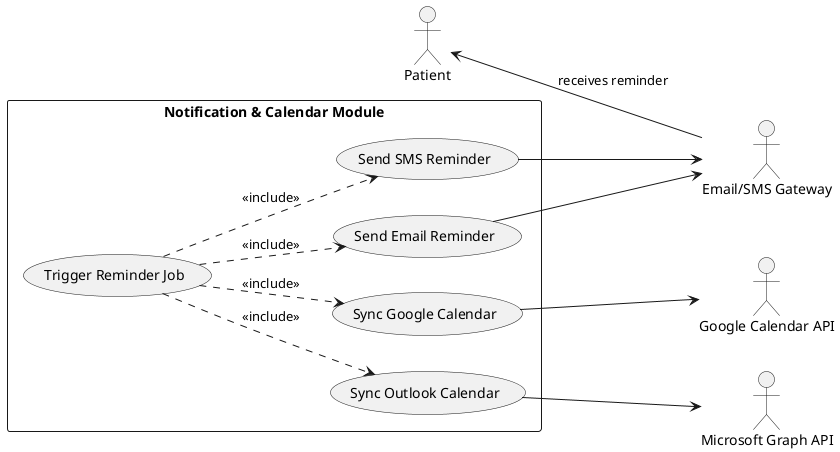
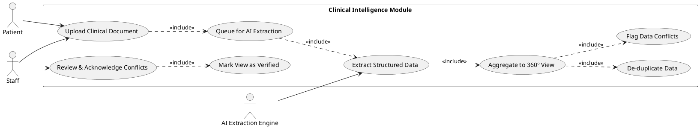
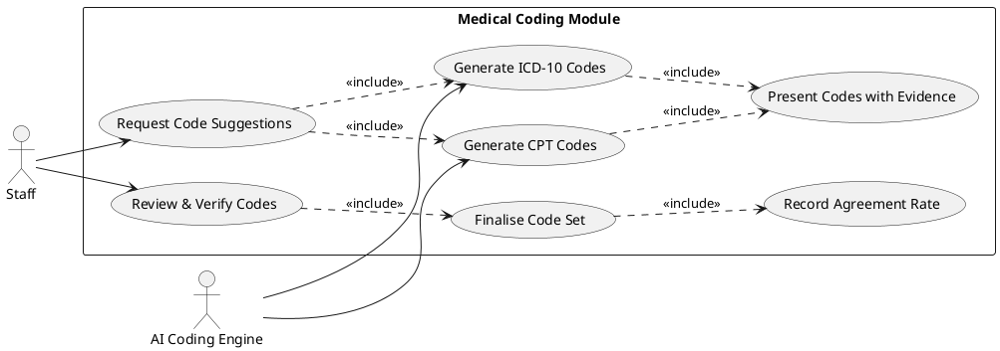
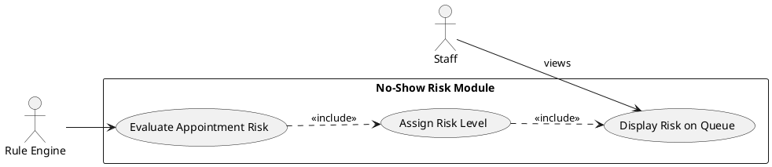
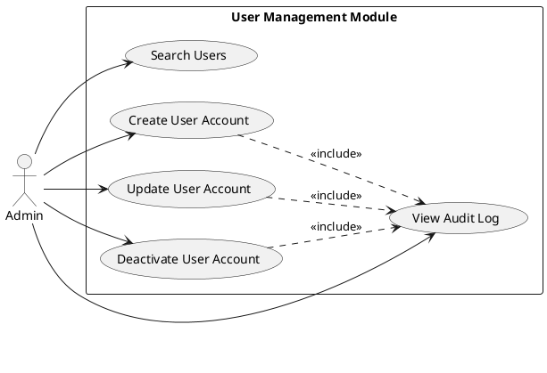

# Requirements Specification

## Feature Goal

Build a unified, standalone healthcare platform (Phase 1) that combines a modern patient-centric appointment booking system with a Trust-First clinical intelligence engine. The platform must bridge the current gap between fragmented scheduling tools and clinical data management by providing:

- A seamless end-to-end appointment lifecycle: flexible intake, intelligent booking, automated reminders, and staff-managed queue.
- An AI-powered clinical data aggregation pipeline that transforms 20+ minutes of manual PDF extraction into a 2-minute human verification action.
- A transparent, Trust-First "360-Degree Patient View" with explicit ICD-10/CPT code suggestions and conflict highlighting, achieving an AI-Human Agreement Rate > 98%.

The current state is a disconnected data pipeline — no integrated booking-with-clinical-context exists — and this platform replaces it entirely for Phase 1 scope.

## Business Justification

- **No-Show Reduction**: Providers experience up to a 15% no-show rate from complex booking and lack of smart reminders; this platform targets a measurable reduction through preferred slot swap, rule-based risk assessment, and automated multi-channel reminders.
- **Clinical Efficiency**: Manual extraction from multi-format clinical PDFs consumes 20+ minutes per patient; the AI extraction pipeline reduces this to ~2 minutes of verification, freeing clinical prep time.
- **Market Differentiation**: Existing tools are fragmented — booking systems lack clinical data context, and AI coding tools suffer a "Black Box" trust deficit. This platform combines both with a traceable, human-verified Trust-First design.
- **Integration with Existing Workflows**: Serves Patients (self-service booking), Staff (walk-in, queue, arrival), and Admin (user management) roles within a single platform, eliminating multi-tool switching.
- **Problems Solved**: High no-show revenue loss, manual data bottleneck in clinical prep, unverified AI code suggestions causing claim denials, and disconnected patient data scattered across documents.

## Feature Scope

The platform is scoped for Phase 1 delivery with three user roles (Patient, Staff, Admin) and the following functional boundaries:

**In-Scope:**

- User account management with role-based access (Patient, Staff, Admin).
- Flexible patient intake: AI-assisted conversational flow or manual form, freely switchable.
- Appointment booking with waitlist, preferred slot swap automation, and staff-only walk-in booking.
- Automated multi-channel reminders (SMS/Email) and Google/Outlook calendar sync via free APIs.
- Post-booking appointment PDF confirmation sent by email.
- Soft insurance pre-check against internal predefined dummy records.
- Clinical document upload (PDF) and AI-driven data extraction for 360-Degree Patient View.
- ICD-10 and CPT code mapping with Trust-First human verification.
- Data conflict detection and de-duplication across uploaded documents.
- Rule-based no-show risk assessment surfaced to staff.
- HIPAA-compliant data handling, immutable audit logging, and session management.

**Out-of-Scope (Phase 1):**

- Provider logins or provider-facing actions.
- Payment gateway integration.
- Family member profile features.
- Patient self-check-in (mobile, web, or QR code).
- Direct bi-directional EHR integration or full claims submission.
- Paid cloud infrastructure (AWS, Azure).

**Technology Stack:**

| Layer | Technology |
|---|---|
| Frontend | React |
| Backend API | .NET |
| Database | PostgreSQL |
| Caching | Upstash Redis |
| Hosting | GitHub Codespaces |
| Auxiliary Tools | Free/open-source only |

### Success Criteria

- [ ] No-show rate demonstrably reduced from the 15% baseline after deployment.
- [ ] Staff administrative time per appointment measurably decreased.
- [ ] Clinical data extraction time reduced from 20 minutes to ~2 minutes (verification only).
- [ ] AI-Human Agreement Rate > 98% for suggested ICD-10 and CPT codes.
- [ ] Platform achieves 99.9% uptime.
- [ ] High volume of patient dashboards created and appointments successfully booked.
- [ ] Quantifiable "Critical Conflicts Identified" metric tracked and reportable.

## Functional Requirements

### AI Suitability Triage Summary

| Classification | Count | Description |
|---|---|---|
| `[DETERMINISTIC]` | 27 | Rule-based logic, calculations, access control, CRUD |
| `[AI-CANDIDATE]` | 6 | NLU, extraction, classification, code generation |
| `[HYBRID]` | 5 | AI suggests, human confirms |

---

### Module 1: User Management & Authentication

- FR-001: [DETERMINISTIC] System MUST allow patients to self-register with a verified email address and a password meeting minimum complexity rules (8+ chars, upper, lower, digit, symbol).
- FR-002: [DETERMINISTIC] System MUST enforce role-based access control restricting platform actions to authorised roles: Patient, Staff, and Admin.
- FR-003: [DETERMINISTIC] System MUST automatically terminate authenticated sessions after 15 minutes of continuous inactivity and require re-authentication.
- FR-004: [DETERMINISTIC] System MUST allow Admin users to create, update, and deactivate Staff and Patient accounts without deleting historical records.
- FR-005: [DETERMINISTIC] System MUST record an immutable, timestamped audit log entry for every create, update, and delete action performed on patient and appointment records, capturing actor ID, role, action type, affected entity, and timestamp.

### Module 2: Patient Intake

- FR-006: [AI-CANDIDATE] System MUST provide an AI-assisted conversational intake flow that collects patient demographic, medical history, current medications, and chief complaint data through natural language dialogue.
- FR-007: [DETERMINISTIC] System MUST provide a traditional manual form-based intake option presenting all required fields for direct patient entry.
- FR-008: [HYBRID] System MUST allow patients to freely switch between the AI-assisted conversational intake and the manual form intake at any point during the intake session, preserving all previously entered data without data loss.
- FR-009: [DETERMINISTIC] System MUST allow patients to edit any previously submitted intake data independently, without requiring staff assistance or account verification calls.

### Module 3: Appointment Booking

- FR-010: [DETERMINISTIC] System MUST allow authenticated patients to view available appointment slots and book a single slot per session.
- FR-011: [DETERMINISTIC] System MUST allow patients to designate one preferred unavailable appointment slot at the time of booking a currently available slot.
- FR-012: [DETERMINISTIC] System MUST automatically swap a patient's existing appointment to their designated preferred slot when that slot becomes available, release the originally booked slot back to the pool, and notify the patient of the change via email and SMS.
- FR-013: [DETERMINISTIC] System MUST maintain a waitlist queue for appointment slots that are fully booked, assigning positions based on request timestamp and notifying the next-in-queue patient when a slot opens.
- FR-014: [DETERMINISTIC] System MUST restrict walk-in appointment booking exclusively to authenticated Staff role users; Patients MUST NOT be able to initiate walk-in bookings.
- FR-015: [DETERMINISTIC] System MUST allow Staff to optionally create a new Patient account during the walk-in booking flow; if the Staff chooses not to create an account, the appointment is recorded with a guest profile.
- FR-016: [DETERMINISTIC] System MUST generate and send a PDF-formatted appointment confirmation containing appointment date, time, location, provider details, and cancellation policy to the patient's email address immediately upon successful booking.
- FR-017: [DETERMINISTIC] System MUST prevent patients from self-checking in through any web portal, mobile interface, or QR code mechanism; arrival confirmation is exclusively a Staff action.

### Module 4: Staff Queue & Arrival Management

- FR-018: [DETERMINISTIC] System MUST allow only Staff role users to view and manage the same-day appointment queue, including the ability to reorder or add walk-in entries.
- FR-019: [DETERMINISTIC] System MUST allow only Staff role users to mark a patient's appointment status as "Arrived"; this action MUST be logged to the audit trail with staff ID and timestamp.

### Module 5: Notifications & Calendar Integration

- FR-020: [DETERMINISTIC] System MUST send automated SMS appointment reminders to patients at configurable intervals (e.g., 48 hours and 2 hours before appointment).
- FR-021: [DETERMINISTIC] System MUST send automated email appointment reminders to patients at the same configurable intervals used for SMS reminders.
- FR-022: [DETERMINISTIC] System MUST support Google Calendar event creation and synchronisation for confirmed appointments using free Google Calendar API credentials.
- FR-023: [DETERMINISTIC] System MUST support Microsoft Outlook Calendar event creation and synchronisation for confirmed appointments using free Microsoft Graph API credentials.

### Module 6: Insurance Pre-Check

- FR-024: [DETERMINISTIC] System MUST perform a soft validation of the patient-provided insurance provider name and insurance ID against an internal, predefined set of dummy insurance records during the intake or booking flow.
- FR-025: [DETERMINISTIC] System MUST display the insurance pre-check result (matched / unmatched / not found) to Staff without blocking or preventing the booking workflow from proceeding.

### Module 7: Clinical Document Management & 360-Degree Patient View

- FR-026: [DETERMINISTIC] System MUST allow authenticated patients and Staff to upload one or more PDF clinical documents (historical records, lab reports, discharge summaries) to the patient profile.
- FR-027: [AI-CANDIDATE] System MUST extract structured clinical data fields — including vitals, medication history, allergy list, past diagnoses, and surgical history — from uploaded unstructured PDF clinical documents using an AI extraction pipeline.
- FR-028: [DETERMINISTIC] System MUST aggregate all extracted clinical data from multiple uploaded documents into a single unified 360-Degree Patient View accessible to authorised Staff.
- FR-029: [DETERMINISTIC] System MUST de-duplicate patient data values (e.g., repeated medication entries from different documents) when building the 360-Degree Patient View, retaining the most recent verified value with source attribution.
- FR-030: [HYBRID] System MUST explicitly surface critical data conflicts — such as contradictory medication dosages or conflicting allergy records identified across multiple documents — in the 360-Degree Patient View, requiring explicit Staff acknowledgement before the view is marked verified.

### Module 8: Medical Coding (ICD-10 & CPT)

- FR-031: [AI-CANDIDATE] System MUST map relevant ICD-10 diagnostic codes from the aggregated clinical data in the 360-Degree Patient View using an AI coding engine.
- FR-032: [AI-CANDIDATE] System MUST map relevant CPT procedure codes from the aggregated clinical data in the 360-Degree Patient View using an AI coding engine.
- FR-033: [HYBRID] System MUST present all AI-suggested ICD-10 and CPT codes alongside source evidence (the clinical text excerpts that justify each code) for Staff review and confirmation before codes are finalised, targeting an AI-Human Agreement Rate exceeding 98%.

### Module 9: No-Show Risk Assessment

- FR-034: [HYBRID] System MUST apply a rule-based no-show risk scoring model to each appointment — considering factors such as prior no-show history, booking lead time, and insurance validation status — and surface the resulting risk indicator (Low / Medium / High) on the Staff queue view.

### Module 10: Security, Compliance & Infrastructure

- FR-035: [DETERMINISTIC] System MUST ensure all patient data is handled, transmitted, and stored in compliance with HIPAA regulations, including encryption of PHI at rest and in transit.
- FR-036: [DETERMINISTIC] System MUST encrypt all data in transit using TLS 1.2 or higher.
- FR-037: [DETERMINISTIC] System MUST encrypt all PHI stored in the PostgreSQL database using column-level or database-level encryption.
- FR-038: [DETERMINISTIC] System MUST use Upstash Redis exclusively for caching session tokens and non-PHI transient data; PHI MUST NOT be cached in Redis.

## Use Case Analysis

### Actors & System Boundary

| Actor | Type | Role Description |
|---|---|---|
| Patient | Primary | Registers, completes intake, books appointments, uploads clinical documents |
| Staff | Primary | Manages walk-ins, queues, arrivals, views 360° Patient View, verifies codes |
| Admin | Primary | Manages user accounts, roles, and system configuration |
| AI Extraction Engine | System Actor | Extracts structured data from uploaded clinical PDFs |
| AI Coding Engine | System Actor | Suggests ICD-10 and CPT codes from aggregated patient data |
| Email/SMS Gateway | System Actor | Delivers appointment reminders and PDF confirmations |
| Google Calendar API | System Actor | Synchronises confirmed appointments to Google Calendar |
| Microsoft Graph API | System Actor | Synchronises confirmed appointments to Outlook Calendar |
| Insurance Record Store | System Actor | Internal dummy insurance record store used for pre-check validation |

---

### Use Case Specifications

#### UC-001: Patient Registration and Login

- **Actor(s)**: Patient
- **Goal**: Create a verified account and authenticate to access platform features.
- **Preconditions**: Patient has a valid email address. No existing account exists for that email.
- **Success Scenario**:
  1. Patient navigates to the registration page.
  2. Patient enters name, email, and password meeting complexity requirements.
  3. System sends a verification email with a confirmation link.
  4. Patient clicks the verification link.
  5. System activates the account and redirects to the Patient dashboard.
  6. Patient logs in with email and password.
  7. System creates an authenticated session with a 15-minute inactivity timeout.
- **Extensions/Alternatives**:
  - 2a. Password does not meet complexity requirements — system displays inline validation error.
  - 3a. Email already registered — system displays "account already exists" message.
  - 4a. Verification link expires — system allows resend of verification email.
  - 6a. Invalid credentials — system displays generic error without revealing which field is incorrect.
- **Postconditions**: Patient has an active authenticated session; account is recorded in the audit log.

##### Use Case Diagram

---

#### UC-002: Patient Intake (AI-Assisted or Manual)

- **Actor(s)**: Patient
- **Goal**: Complete the pre-appointment intake form to provide health history and current symptoms.
- **Preconditions**: Patient is authenticated. Appointment booking is in progress or patient is updating their profile.
- **Success Scenario**:
  1. Patient selects intake method: AI-Assisted Conversation or Manual Form.
  2a. *(AI-Assisted)*: AI engine presents conversational prompts; patient responds in natural language; system extracts structured fields.
  2b. *(Manual)*: Patient fills in all required fields directly in the form.
  3. Patient reviews all extracted / entered data.
  4. Patient submits the completed intake.
  5. System saves structured intake data to the patient profile.
- **Extensions/Alternatives**:
  - 2a-switch. Patient switches from AI to Manual mid-session — system preserves all data captured so far and pre-fills the manual form.
  - 2b-switch. Patient switches from Manual to AI mid-session — system retains entered values and resumes conversational flow.
  - 4a. Patient edits a previously submitted intake — system allows edits without staff intervention.
- **Postconditions**: Structured intake data is saved to the patient profile and is available for booking and clinical aggregation.

##### Use Case Diagram

---

#### UC-003: Appointment Booking with Preferred Slot Swap

- **Actor(s)**: Patient
- **Goal**: Book an available appointment slot and optionally register a preferred slot for automatic swap.
- **Preconditions**: Patient is authenticated and has completed intake. Available slots exist in the schedule.
- **Success Scenario**:
  1. Patient views the appointment booking calendar showing available and unavailable slots.
  2. Patient selects an available slot to book.
  3. Patient optionally selects a preferred unavailable slot.
  4. Patient completes insurance information for soft pre-check.
  5. System validates insurance details against the internal dummy record store.
  6. System confirms the booking, records the preferred slot if specified, and adds the patient to the waitlist for the preferred slot.
  7. System sends PDF confirmation email to the patient.
  8. System triggers Google / Outlook calendar sync for the confirmed appointment.
  9. When the preferred slot becomes available, the system automatically swaps the appointment, releases the original slot, and notifies the patient.
- **Extensions/Alternatives**:
  - 2a. No available slots — patient may join the waitlist for any slot.
  - 4a. Insurance validation fails (unmatched) — result is shown to staff; booking is not blocked.
  - 7a. Email delivery fails — system retries and logs the failure to the audit trail.
- **Postconditions**: Appointment is confirmed; PDF confirmation sent; preferred slot swap rule is active; calendar event created.

##### Use Case Diagram

---

#### UC-004: Staff Walk-In Booking

- **Actor(s)**: Staff
- **Goal**: Register a walk-in patient appointment and optionally create a patient account.
- **Preconditions**: Staff is authenticated. Walk-in patient is physically present.
- **Success Scenario**:
  1. Staff opens the walk-in booking panel from the Staff dashboard.
  2. Staff searches for existing patient by name or date of birth.
  3a. *(Existing patient found)*: Staff confirms patient identity and creates appointment.
  3b. *(New patient)*: Staff optionally creates a new Patient account and records demographic details.
  4. Staff selects the walk-in appointment slot from the same-day queue.
  5. System records the walk-in appointment and adds it to the same-day queue.
  6. System generates a PDF confirmation and sends to the patient's email (if account exists).
- **Extensions/Alternatives**:
  - 3b-no-account. Staff chooses not to create an account — appointment is recorded with a guest profile entry.
  - 4a. No available slots — Staff overrides and manually inserts the walk-in into the queue.
- **Postconditions**: Walk-in appointment is recorded in the same-day queue; audit log entry created with Staff ID.

##### Use Case Diagram

---

#### UC-005: Manage Same-Day Queue and Mark Patient Arrival

- **Actor(s)**: Staff
- **Goal**: Manage the daily appointment queue and confirm patient arrivals.
- **Preconditions**: Staff is authenticated. Appointment date is today. Appointments exist in the same-day queue.
- **Success Scenario**:
  1. Staff opens the same-day queue view.
  2. Staff reviews the ordered list of scheduled and walk-in appointments.
  3. Staff reorders appointments as operationally needed.
  4. Patient arrives — Staff selects the patient's appointment and marks status as "Arrived".
  5. System updates appointment status, records the arrival timestamp, and logs the action with Staff ID.
- **Extensions/Alternatives**:
  - 2a. Walk-in arrives without booking — Staff uses UC-004 to add them first.
  - 4a. Staff attempts to mark a patient arrived who is not scheduled for today — system warns and requires confirmation.
- **Postconditions**: Patient status is "Arrived"; audit log entry recorded; queue view updated.

##### Use Case Diagram

---

#### UC-006: Appointment Reminders and Calendar Sync

- **Actor(s)**: Patient, Email/SMS Gateway, Google Calendar API, Microsoft Graph API
- **Goal**: Automatically remind patients of upcoming appointments and keep calendars in sync.
- **Preconditions**: Appointment is confirmed. Patient has valid contact details (email, phone).
- **Success Scenario**:
  1. System scheduler triggers at configured reminder intervals (e.g., 48 hours and 2 hours before appointment).
  2. System sends SMS reminder to patient's registered phone number.
  3. System sends email reminder to patient's registered email address.
  4. System creates or updates a calendar event via Google Calendar API.
  5. System creates or updates a calendar event via Microsoft Graph API.
- **Extensions/Alternatives**:
  - 2a. SMS delivery fails — system logs failure; retries once after 5 minutes.
  - 3a. Email delivery fails — system logs failure; retries once after 5 minutes.
  - 4a. Google Calendar API call fails — system logs the error and proceeds; does not block reminders.
- **Postconditions**: Patient has received SMS and email reminders; calendar events are created or updated.

##### Use Case Diagram

---

#### UC-007: Clinical Document Upload and 360-Degree Patient View

- **Actor(s)**: Patient, Staff, AI Extraction Engine
- **Goal**: Upload clinical documents and build a unified, de-duplicated patient profile with conflict alerts.
- **Preconditions**: Authenticated Patient or Staff user. Patient profile exists.
- **Success Scenario**:
  1. Patient or Staff uploads one or more PDF clinical documents to the patient profile.
  2. System queues each uploaded document for AI extraction.
  3. AI Extraction Engine processes each PDF and returns structured fields: vitals, medications, allergies, diagnoses, surgical history.
  4. System aggregates extracted fields across all documents into the 360-Degree Patient View.
  5. System de-duplicates repeated entries, retaining the most recent verified value with source attribution.
  6. System identifies and flags critical data conflicts (e.g., contradictory medication dosages).
  7. Staff reviews the 360-Degree Patient View; acknowledges flagged conflicts.
  8. System marks the view as verified upon Staff acknowledgement of all conflicts.
- **Extensions/Alternatives**:
  - 2a. Uploaded file is not a PDF — system rejects and displays supported format message.
  - 3a. AI extraction fails on a document — system flags the document as "Extraction Failed" and allows manual data entry fallback.
  - 6a. No conflicts detected — system marks view as conflict-free automatically.
- **Postconditions**: 360-Degree Patient View is populated, de-duplicated, and conflict-acknowledged; source attribution recorded for each data point.

##### Use Case Diagram

---

#### UC-008: Medical Code Mapping with Trust-First Verification

- **Actor(s)**: Staff, AI Coding Engine
- **Goal**: Generate ICD-10 and CPT code suggestions from aggregated patient data and have Staff verify before finalising.
- **Preconditions**: 360-Degree Patient View is populated and marked verified. Staff is authenticated.
- **Success Scenario**:
  1. Staff opens the Medical Coding panel for the patient.
  2. AI Coding Engine analyses the aggregated clinical data and generates ICD-10 diagnostic codes with supporting evidence excerpts.
  3. AI Coding Engine generates CPT procedure codes with supporting evidence excerpts.
  4. System presents each suggested code alongside the source clinical text that justifies it.
  5. Staff reviews each code suggestion and accepts, modifies, or rejects it.
  6. Staff confirms the final code set.
  7. System records the finalised codes, Staff confirmation, and AI Agreement Rate metric.
- **Extensions/Alternatives**:
  - 2a. AI Coding Engine cannot map a code with sufficient confidence — system marks the entry as "Needs Review" rather than auto-suggesting.
  - 5a. Staff rejects a suggested code — system records the rejection and the Staff-supplied replacement for model feedback.
- **Postconditions**: Finalised ICD-10 and CPT codes are saved to the patient record; AI-Human Agreement Rate metric is updated.

##### Use Case Diagram

---

#### UC-009: No-Show Risk Assessment

- **Actor(s)**: Staff, System (Rule Engine)
- **Goal**: Surface no-show risk level for each appointment to allow proactive Staff outreach.
- **Preconditions**: Appointment is confirmed. Patient history data is available.
- **Success Scenario**:
  1. System rule engine evaluates each upcoming appointment using factors: prior no-show count, booking lead time, insurance validation status, and intake completion status.
  2. System assigns a risk level: Low, Medium, or High.
  3. Risk indicator is displayed alongside the appointment in the Staff queue view.
  4. Staff uses the risk indicator to prioritise reminder outreach.
- **Extensions/Alternatives**:
  - 1a. Insufficient history for a new patient — system defaults to Medium risk.
- **Postconditions**: Risk level assigned and visible to Staff on queue view.

##### Use Case Diagram

---

#### UC-010: Admin User Management

- **Actor(s)**: Admin
- **Goal**: Create, update, and deactivate Staff and Patient accounts without deleting historical records.
- **Preconditions**: Admin is authenticated.
- **Success Scenario**:
  1. Admin navigates to the User Management panel.
  2. Admin searches for a user by name, email, or role.
  3. Admin selects a user and views account details and activity history.
  4. Admin creates a new Staff or Patient account, or updates an existing account's role/status.
  5. Admin deactivates a user — system soft-deletes the account (status = Inactive), preserving all historical records.
  6. System logs the Admin action to the immutable audit trail.
- **Extensions/Alternatives**:
  - 4a. Email conflict on creation — system displays error and does not create duplicate.
  - 5a. Admin attempts hard-delete — system rejects the action with an explanation.
- **Postconditions**: User account is created, updated, or deactivated; audit log entry recorded.

##### Use Case Diagram

## Risks & Mitigations

1. **HIPAA Non-Compliance Risk**: Improper handling or storage of PHI could result in regulatory penalties. *Mitigation*: Enforce column-level encryption on PHI fields in PostgreSQL, TLS 1.2+ for all data in transit, and conduct a HIPAA compliance review before go-live.

2. **AI Extraction Accuracy Below 98% Threshold**: If the AI extraction or coding engine fails to meet the >98% AI-Human Agreement Rate, clinical data errors could cause harm or claim denials. *Mitigation*: Implement Trust-First design requiring mandatory Staff verification of all AI suggestions; track the agreement rate metric per session and flag degraded performance.

3. **Calendar API Availability / Rate Limiting**: Free-tier Google Calendar and Microsoft Graph APIs may impose rate limits or experience outages. *Mitigation*: Implement exponential backoff, queue-based retry logic, and degrade gracefully by logging failures without blocking the booking workflow.

4. **Preferred Slot Swap Race Condition**: Concurrent preferred-slot openings for multiple waitlisted patients may cause race conditions. *Mitigation*: Use PostgreSQL row-level locking and a serialised queue mechanism for slot assignment to ensure exactly-once swap processing.

5. **Session Timeout & Data Loss During Intake**: A 15-minute session timeout mid-intake could cause patients to lose unsaved intake data. *Mitigation*: Implement auto-save of intake form state every 60 seconds to the server and warn the user 2 minutes before timeout with a session extension prompt.

## Constraints & Assumptions

1. **Hosting Constraint**: The platform MUST run exclusively on GitHub Codespaces or equivalent free/open-source hosting. Paid cloud services (AWS, Azure) are strictly out of scope for Phase 1, limiting scalability and geographic distribution.

2. **Insurance Records Are Dummy Data**: The insurance pre-check validates against an internal predefined dummy record set only. No real-time insurance carrier API integration is in scope; validation results are advisory and do not block workflows.

3. **Free API Rate Limits**: Google Calendar and Microsoft Outlook integrations rely on free-tier API credentials, which may impose daily/monthly quotas. The system design assumes these limits are not breached during Phase 1 patient volumes.

4. **AI Tools Are Open-Source / Free**: All AI components (extraction engine, coding engine, conversational intake NLU) must use free and open-source models or libraries. No paid AI service subscriptions (e.g., commercial LLM APIs) are permitted in Phase 1.

5. **No Real EHR Integration**: Phase 1 assumes all clinical data enters the platform exclusively through patient-uploaded PDF documents. No bi-directional EHR, HL7 FHIR, or claims submission integration is assumed to be available; data quality and completeness depend on what patients upload.
